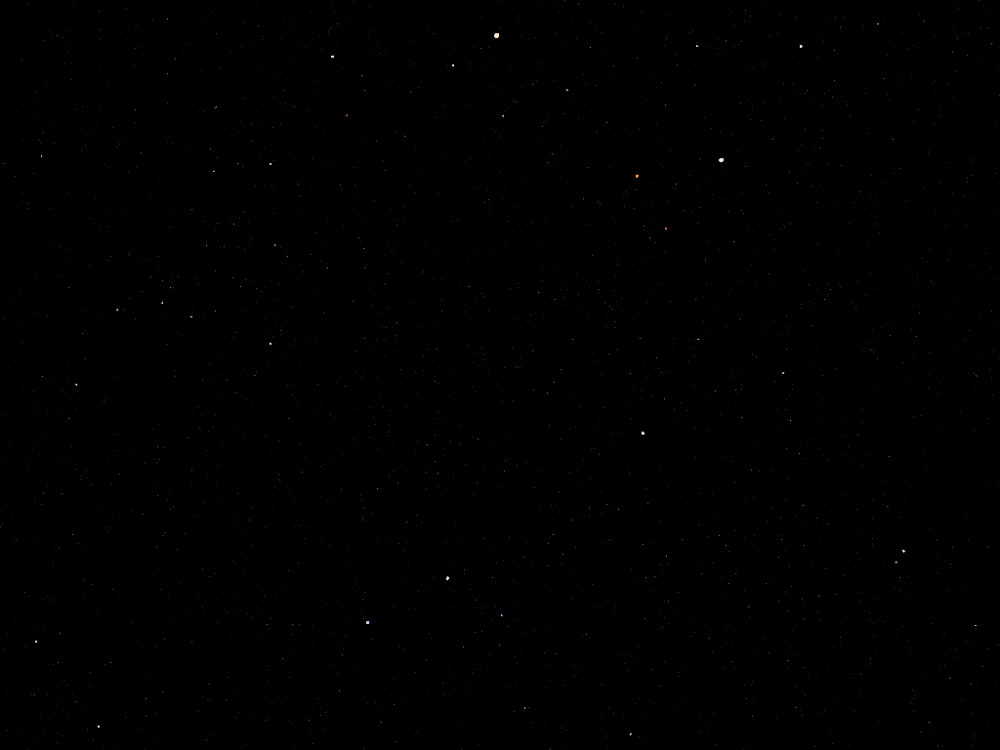

# StarFly2
StarFly v2 Screen Saver  
Windows screensaver, simulates flying thru star field with some FTL speed.  
Resembles "Starfield" screensaver from old Windows, but with more stars, colors and other small features.  



### Installation Instructions
Download the latest zip from Releases and unpack to some folder.  
Right click on StarFly2.scr and select 'Install'.  
Left click or select Test if you'd like to see it without installing it.  

### Details
Apparently big stars are drawn as circles of fixed color, apparently small - as single pixels with color fading with distance.  
Stars varies in size, distribution is somewhat like in real space (configurable).  
Star colors could be random RGB or more real black-body spectrum (distribution is just uniform).  
  
Render via GDI but pretty fast. 16-bit integer z-buffer used.  
No anti-aliasing of circles or several stars 'combining light' in one pixel.  
Initial generation makes even 3D star distribution in viewing cone (limited by FarPlane).  
If star moves out of sight, another is generated in the distance and fades-in from blackness.  
  
Configuration: Number of stars, fly speed, render rate, center position, zoom, star scale and scheme, colorization and scheme, color fading coefficient, fade-in time.

### Configuration
Configuration is possible via editing StarFly2.ini by notepad or else.  
This file should be located in same folder as installed StarFly2.scr.  
Default file in zip release contains default values.  

```
Stars            - Number of stars seen simultaneously.
Speed            - Fly speed. 1.0 means 5s for flying distance to FarPlane; 0.005 - 1000s.
TimerRate        - Interval between frames in ms. 40 means render with ~25 fps.
CenterX, CenterY - 'Destination point' location. (0.5, 0.5) is a center of desktop.
                   If you have two similar monitors placed horizontally then (0.75, 0.5) would be center of right one.
                   Negative values and >1.0 are possible, but not fully supported.
Zoom             - 1.0 - ~90' view angle, >>1.0 - telescope, <<1.0 - fish-eye. Does not affect star sizes, only their motion and fading with distance.
StarSize         - Base for star size. Value = distance at which star have radius 1 pixel.
SizeType         - 0 - All stars have StarSize;
                   1 - StarSize * [0.0, 2.0);
                   2 - Something like Gamma distribution with max at StarSize.
DarkestRGB       - Darkest value for RGB components of random star color. 0 - black, full red, full blue are possible, 255 - all stars are white
ColorType        - Type of color generation for stars
                   0 - random in range [DarkestRGB, 255], could produce green, purple, cyan and so on - colors are not possible in real space. DarkestRGB recommended is 64;
                   1 - random black-body radiation color (value DarkestRGB allows to decrease color saturation).
FadePower        - How fast star brightness fades with distance. 1.0 - linearly, 0.0 - does not fade.
FadeInTime       - How fast newly generated star appears, ms. Does not affect program start.
```

### Build

Release was build with MSVS.  
Solution and project files are included.

### License
Copyright (C) 2024, OverQuantum  
This program is licensed under the GNU General Public License v3